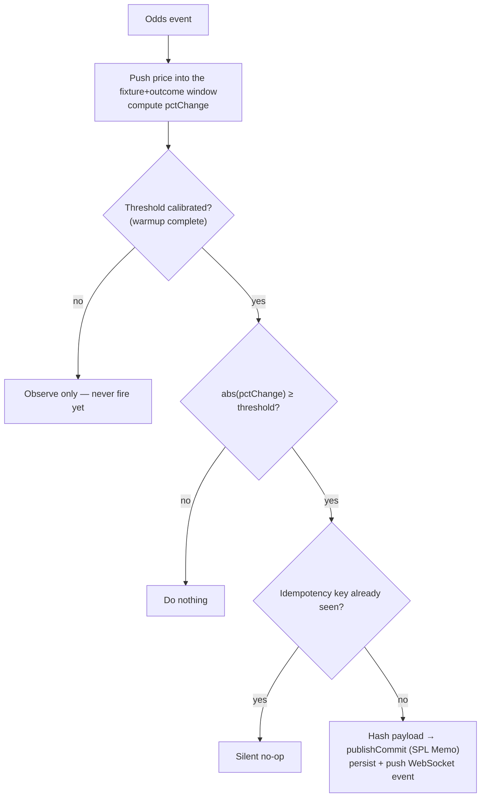

# The Agents

`agent-aggressive` and `agent-conservative` are two standalone processes that share the exact same `AgentLoop` implementation from `packages/agent-runtime` — the only thing that differs between them is configuration (`k`, `windowSeconds`, wallet). Neither app duplicates decision logic; both are thin shims that inject config into the shared loop.

## Auto-calibrated threshold, not a hand-tuned number

The trigger threshold is never a fixed percentage a human typed into a config file — that would embed a human judgment call inside a system the whole point of which is to run without one. Instead, each agent calibrates its own threshold from the volatility it observes in that specific fixture, during a warmup window:

```typescript
class AutoCalibratedThreshold {
  private readings: number[] = [];
  private calibratedThreshold: number | null = null;

  constructor(private warmupReadings: number, private sensitivityMultiplier: number) {}

  observe(pctChangeSample: number) {
    if (this.calibratedThreshold !== null) return; // already locked in for this fixture
    this.readings.push(pctChangeSample);
    if (this.readings.length >= this.warmupReadings) {
      this.calibratedThreshold = this.computeThreshold();
    }
  }

  private computeThreshold(): number {
    const mean = this.readings.reduce((a, b) => a + b, 0) / this.readings.length;
    const variance = this.readings.reduce((acc, v) => acc + (v - mean) ** 2, 0) / this.readings.length;
    return mean + this.sensitivityMultiplier * Math.sqrt(variance); // mean + k·σ
  }
}
```

During the first ~30 odds ticks of a fixture, both agents only observe and accumulate statistics — no signal can fire yet. After that, the threshold locks in for that fixture specifically: a tense final and a lopsided friendly naturally calibrate to different thresholds. The only human-chosen parameter left is the sensitivity multiplier `k` — and that's a strategy choice, not an alarm-sensitivity dial.

| Parameter | Agent-Aggressive | Agent-Conservative |
|---|---|---|
| `k` (sensitivity multiplier) | **1.5** | **3.0** |
| Window | 60s | 180s |
| Expected signal frequency | High — reacts to nearly any wobble | Low — only on dramatic swings |

## The decision loop




```
on every Odds event:
  1. push the price into that fixture+outcome's sliding window
  2. compute pctChange = (newPrice - oldestPriceInWindow) / oldestPriceInWindow
  3. feed pctChange into that fixture's AutoCalibratedThreshold
     → still warming up? observe only, never fire.
  4. |pctChange| >= calibrated threshold?
       a. build the canonical SignalPayload, hash it
       b. compute the idempotency key; try INSERT — a collision means this
          exact event was already processed, abort silently (not an error)
       c. publishCommit() → SPL Memo transaction on Solana
       d. persist the commit, push a WebSocket event to the dashboard

on every Score event:
  1. is this a game_finalised record (statusId=100, period=100)?
     → covers regulation, extra time, penalties, and abandoned matches
       the same way
  2. mark the fixture 'finished'
  3. find every signal this agent hasn't graded yet for this fixture
  4. once per fixture (not per signal): cross-check the final score against
     TxLINE's on-chain Merkle proof
  5. for each pending signal, in order:
       - publishReveal() → a second Memo transaction, referencing the commit
       - recompute the hash from the stored payload, compare to what was
         committed (hash_verified — never assumed true)
       - grade it (correct = outcome_key matches the real result)
       - once per signal: cross-check the specific odds tick that triggered
         it against TxLINE's Merkle proof too (odds_proof_checked)
```

Both event handlers are enqueued onto a single serialized transaction queue with a minimum spacing between publishes — a public devnet RPC rate-limits aggressively under a burst of transactions, and a settlement is enqueued as **one atomic unit** so it can never run ahead of commits still in flight for the same fixture (a race this project hit and fixed during real testing — see [TxLINE Integration](/txline-integration) for the story).

## Why the raw "accuracy %" number looks lower than 50%

Each agent tracks **three markets simultaneously** for every match — participant-1-wins, draw, participant-2-wins — and fires an independent signal on whichever market's odds move sharply. Only one of the three can be true once the match ends, so two-thirds of the buckets are *guaranteed* "incorrect" even for a signal that read the market correctly in the moment. Chance alone lands around 33%, not 50%.

In this project's own devnet run against a real quarterfinal (France beat Morocco), every single signal that bet on the actual winning outcome graded correct — **105/105** for Agent-Aggressive, **253/253** for Agent-Conservative — while every signal on the other two buckets graded incorrect by construction. The headline percentage (36.8% and 27.4% respectively) is an honest number, not a bug; it's just measuring something more specific than "did the agent call the final score," and the dashboard's built-in tutorial explains this to a first-time viewer directly.

## The grading engine

```typescript
async function gradeFixtureSignals(fixtureId: number, finalScoreRecord: ScoreRecord) {
  const outcome = determineOutcome(finalScoreRecord);
  const pendingSignals = await store.findPendingSignalsByFixture(fixtureId, agentId);

  const validation = await fetchScoreValidation(fixtureId, finalScoreRecord.seq, [1, 2]);
  const isValidOnChain = await callValidateStatV2View(validation); // once per fixture

  for (const signal of pendingSignals) {
    const correct = signal.outcome_key === outcome;
    const revealTxSig = await publishReveal(connection, agentWallet, signal.id, signal.commit_tx_sig, payload);
    const hashVerified = recomputedHash === signal.payload_hash; // never assumed
    await store.insertReveal({ signal_id: signal.id, reveal_tx_sig: revealTxSig, hash_verified: hashVerified });
    await store.insertGrade({ signal_id: signal.id, final_outcome: outcome, correct, validation_proof_checked: isValidOnChain });
  }
}
```

The dashboard's "✅ verified on-chain" badge only lights up once **every** graded signal behind an agent's accuracy number has had its Validation Proof cross-checked — computed over the full graded set, never a capped recent sample, so the badge is never shown optimistically while older signals remain unverified.
