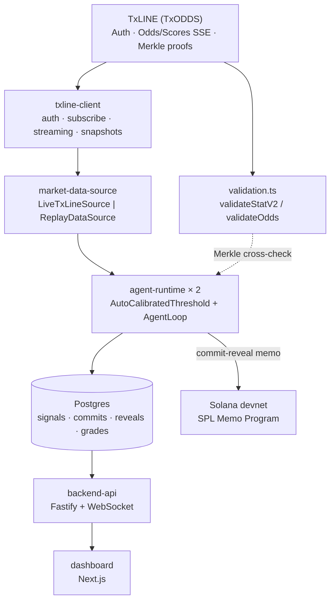

# Architecture

## Component overview



The same flow in text:

```
TxLINE (TxODDS)
  Auth (JWT) · Odds/Scores REST + SSE · Merkle validation proofs · Solana program
        │ HTTPS / SSE                              │ Merkle proofs
        ▼                                           ▼
  txline-client  ──────────────────────────►  validation.ts
  (auth, subscribe, streaming, snapshots)     (validateStatV2 / validateOdds)
        │
        ▼
  market-data-source            (LiveTxLineSource  │  ReplayDataSource)
        │ normalized Odds/Score events, identical handler shape either way
        ▼
  agent-runtime (× 2 processes: agent-aggressive, agent-conservative)
    - AutoCalibratedThreshold + SlidingOddsWindow  (detector)
    - AgentLoop                                     (commit → wait → reveal → grade)
        │                                    │
        │ signals/commits/reveals/grades     │ commit-reveal memo
        ▼                                    ▼
  Postgres                              Solana (devnet)
                                         SPL Memo Program
        │
        ▼
  backend-api (Fastify + WebSocket)
        │
        ▼
  dashboard (Next.js)
```

## Design principle #1: agents never talk to TxLINE directly

The single most load-bearing architectural decision in this project: agents never call the TxLINE API themselves. They talk to a `MarketDataSource` interface with exactly two implementations:

```typescript
interface MarketDataSource {
  onOdds(handler: (event: OddsEvent) => void): void;
  onScore(handler: (event: ScoreEvent) => void): void;
  start(): Promise<void>;
  stop(): Promise<void>;
}

class LiveTxLineSource implements MarketDataSource { /* real SSE stream */ }
class ReplayDataSource implements MarketDataSource { /* recorded_events, same timing */ }
```

The agent's decision code is **identical** whether it's running live or in replay. This directly de-risks the hackathon's judging calendar — evaluation happens after the World Cup ends, when no live match exists to demo against — and doubles as a deterministic test harness: any bug can be reproduced by re-running the same replay.

## Replay mode

`ReplayDataSource` reads rows from the `recorded_events` table (populated either by backfilling a finished fixture's full history via REST, or by recording a live stream tick-by-tick as it happens) and re-emits them respecting the original inter-event timing, scaled by a configurable `speedMultiplier`. The dashboard additionally animates this replay client-side (see [Dashboard & User Flow](/dashboard-user-flow)) so a judge opening the app days after a match ended still sees the commit → reveal progression unfold, instead of a frozen final state.

A fixture's `tracked_fixtures.captured_live` flag distinguishes data observed live from data reconstructed after the fact — the two are equally real and on-chain-verifiable, but a reconstructed fixture's `detected_at`/`committed_at` timestamps reflect when the replay was processed, not the original match time (rewriting them to "look live" would silently contradict what Solscan shows for the same transaction signature, which is exactly the kind of tamper the whole project exists to make impossible).

## Design principle #2: everything indexed by fixture from day one

Every piece of agent state — odds buffers, calibrated thresholds, pending signals — is keyed by `fixtureId` from the first line of code, never assumed to be "the one active match":

```typescript
class MultiFixtureAgentState {
  private windows = new Map<string, SlidingOddsWindow>();          // keyed fixtureId:outcomeKey
  private thresholds = new Map<string, AutoCalibratedThreshold>(); // keyed fixtureId:outcomeKey
}
```

This costs nothing to decide up front and is expensive to retrofit — the same two agent processes already cover every fixture TxLINE streams simultaneously, with zero architecture changes needed to track more matches.

## Data model

```sql
CREATE TABLE agents (
  id                     TEXT PRIMARY KEY,           -- 'agent-aggressive' | 'agent-conservative'
  sensitivity_multiplier NUMERIC NOT NULL,            -- k: 1.5 or 3.0
  window_seconds         INTEGER NOT NULL,
  warmup_readings        INTEGER NOT NULL DEFAULT 30,
  wallet_pubkey          TEXT NOT NULL
);

CREATE TABLE tracked_fixtures (
  fixture_id      BIGINT PRIMARY KEY,
  competition     TEXT, participant1 TEXT, participant2 TEXT,
  start_time      TIMESTAMPTZ,
  status          TEXT DEFAULT 'scheduled' CHECK (status IN ('scheduled','live','finished')),
  captured_live   BOOLEAN NOT NULL DEFAULT true
);

CREATE TABLE signals (
  id                UUID PRIMARY KEY DEFAULT gen_random_uuid(),
  agent_id          TEXT REFERENCES agents(id),
  fixture_id        BIGINT REFERENCES tracked_fixtures(fixture_id),
  outcome_key       TEXT NOT NULL,        -- e.g. 'participant1_win'
  odds_message_id   TEXT NOT NULL,
  odds_ts           BIGINT NOT NULL,
  pct_change        NUMERIC NOT NULL,
  payload_json      JSONB NOT NULL,       -- canonical payload that becomes the hash
  payload_hash      TEXT NOT NULL,
  idempotency_key   TEXT NOT NULL
);
CREATE UNIQUE INDEX signals_idempotency_uq ON signals (agent_id, idempotency_key);

CREATE TABLE commits (
  signal_id     UUID PRIMARY KEY REFERENCES signals(id),
  commit_tx_sig TEXT NOT NULL,
  committed_at  TIMESTAMPTZ DEFAULT now()
);

CREATE TABLE reveals (
  signal_id     UUID PRIMARY KEY REFERENCES signals(id),
  reveal_tx_sig TEXT NOT NULL,
  hash_verified BOOLEAN NOT NULL      -- recomputed and compared, never assumed
);

CREATE TABLE grades (
  signal_id                 UUID PRIMARY KEY REFERENCES signals(id),
  final_outcome             TEXT NOT NULL,
  correct                   BOOLEAN NOT NULL,
  scores_seq_used           INTEGER NOT NULL,
  validation_proof_checked  BOOLEAN DEFAULT false,  -- score confirmed against TxLINE's Merkle root
  odds_proof_checked        BOOLEAN DEFAULT false    -- the triggering odds tick confirmed the same way
);
```

## The canonical signal payload

For a commit hash to be independently reproducible, the payload must serialize deterministically — same key order, every time:

```typescript
interface SignalPayload {
  version: 1;
  agentId: string;
  fixtureId: number;
  outcomeKey: string;
  oddsMessageId: string;
  oddsTs: number;
  pctBefore: number;
  pctAfter: number;
  pctChange: number;
  detectedAtIso: string;
}

function canonicalize(payload: SignalPayload): string {
  return JSON.stringify(payload, Object.keys(payload).sort());
}
function hashPayload(payload: SignalPayload): Buffer {
  return crypto.createHash("sha256").update(canonicalize(payload), "utf8").digest();
}
```

This code is treated as frozen: any change to the serialization format breaks retroactive verifiability of already-published commits, so a format change requires a new `version`, never a silent edit.

## Production hardening

Three inexpensive guardrails, present from day one rather than bolted on:

1. **Idempotency.** The idempotency key is derived deterministically from `agentId + oddsMessageId + outcomeKey` — never a timestamp, which would change on every retry. A unique index on `(agent_id, idempotency_key)` means reprocessing the same event (an SSE reconnect, a replay restart) can never produce a second commit; a unique-constraint violation is treated as a successful no-op, not an error.
2. **Reconnection with exponential backoff.** `ReconnectingSseClient` (in `market-data-source`, not `agent-runtime` — this is a data-source resilience concern, not an agent decision) treats every connection drop as fatal for that attempt, even ones the underlying SSE library would silently retry on its own, and backs off exponentially up to a 30s ceiling.
3. **Wallet balance monitoring.** A periodic check pauses new commit attempts (never reveals already in flight) once a wallet's balance drops below a safety floor, resuming automatically once topped up — see [Production Readiness](/production-readiness) for how this was actually found *not* pausing anything in an earlier build and fixed.

## Self-healing: orphaned signal reconciliation

If a process crashes between creating a `signals` row and publishing its `commits` row, the idempotency guard means that exact detection can never fire again — without reconciliation, it would be stuck forever. On every `start()`, `AgentLoop` finds these orphans and republishes their commit using the already-frozen payload hash — **but only for fixtures not yet graded**. A commit published after the result is already knowable would be dishonest, so those cases are logged as unrecoverable instead of silently "fixed." Both paths were validated against real crash artifacts produced during this project's own testing, not synthetic data.
