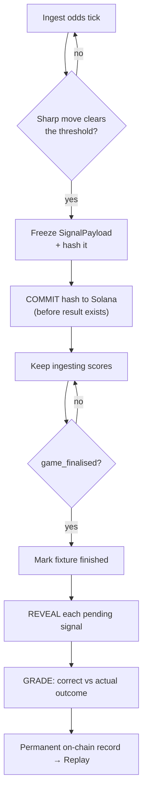

  
  
  

# 2 · Autonomous Operation

> *After deploy, no human touches anything, a literal, eliminatory criterion.*

## We watched it prove this, live, on a real match

This is the criterion that eliminates entrants, so we will not argue it in the abstract. We will tell you what happened on **July 14–15, 2026**, while we were writing this very documentation.

The World Cup semifinal **France × Spain** kicked off. The two agents, already running on their server, were consuming the odds and committing signals on their own. We opened a read-only watchdog against the public API and simply observed. We did not touch the agents, the database, or the chain. The timeline it recorded:

- **During play:** the agents committed continuously. Rush climbed past **5,000 signals** on this fixture alone; Sage committed **1,808**. The backend answered every health check `200 OK`, and the newest-signal timestamp advanced in real time.
- **At the final whistle:** the agents received the score stream's `game_finalised` event. With no human involved, the fixture's status flipped to `finished` and the agents **began revealing and grading every pending signal automatically**.
- **Over the following ~3.5 hours:** the agents published **thousands of reveal transactions to Solana, one at a time**, draining the entire backlog. Sage settled to **1,807 of 1,808** signals; Rush ground through its much larger pile of **~6,400**.
- **The end state:** the match moved from the **Live** tab to the **Replay** tab, a permanent, fully-graded, on-chain record, assembled without a single human action.

<b>Figure 1 - France × Spain after full-time: fully settled and moved to Replay, assembled with zero human input</b>

  

Source: The authors (2026)

## The full loop, and why nothing in it needs a human

The agent's `AgentLoop` is the whole employee. Once `start()` is called, it runs this cycle forever, unattended, with every hand-off automatic:

There is no step that waits for approval, no dashboard button a human must press to advance the pipeline. The dashboard is **read-only by design**: it can observe what the agents have done, but it cannot act on their behalf, precisely so that "autonomous" is a structural fact and not a promise.

## It doesn't just run, it survives

Autonomy that dies on the first hiccup is not autonomy. Sentinel Arena assumes the world is hostile and keeps itself alive:

- **It heals its own crashes.** If the process dies between recording a signal and landing its commit, it leaves an orphan. On restart, the agent republishes the commit late **using the already-frozen hash**, but only for fixtures it hasn't already graded. A commit published after the result is knowable would be a dishonest claim, so those are logged as unrecoverable rather than quietly "fixed."
- **It protects its own wallet.** A background monitor **pauses new commits** when the balance drops below the transaction-fee safety floor, resuming automatically when topped up.
- **It refuses to trip over its own bursts.** All blockchain publishing is serialized through a single queue with minimum spacing, so a volatile moment cannot fire dozens of concurrent transactions and get rate-limited.
- **It refuses to be killed by a stray error.** Last-resort `unhandledRejection` and `uncaughtException` handlers keep the process alive through transient RPC hiccups inside library timer callbacks.

## An honesty guarantee that also proves autonomy

Sage finished at **1,807 of 1,808**, not a clean 1,808. That single un-revealed signal is the orphan-integrity guard doing its job: it was a prediction that could not be revealed honestly, so the agent left it alone rather than fabricating a reveal to round out its own numbers.

This matters for autonomy because it shows the system makes **principled decisions on its own**, including the decision *not* to act. An autonomous employee you can trust is one that will leave a number imperfect rather than lie to make it look finished.

## Where it runs, and why that placement is deliberate

The agents run **24/7 on an Oracle Cloud Always Free `VM.Standard.E2.1.Micro` VM**, each as a native Node.js process managed by `systemd` (`Restart=always`), not Docker, that shape's memory was too tight for a container runtime to install reliably. Web hosts with free tiers spin their services down after minutes of inactivity, which is fatal for a process that must stay awake to catch a final whistle at an unpredictable time, and Oracle's Always Free resources never expire. Separating the always-on agents from the occasionally-viewed dashboard and the database means each piece lives where its uptime needs are actually met.

## Why this satisfies the criterion

Our answer is a real, observed run: **an entire World Cup match, kickoff, play, final whistle, thousands of on-chain reveals, and settlement into a permanent record, completed with nobody touching anything.** The loop needs no human to advance, the dashboard is structurally incapable of acting for the agents, and the system heals its own crashes, guards its own wallet, and paces its own transactions so that "unattended" holds through real-world turbulence, not just a calm demo.

*Previous: [← 1 · Core Functionality](./criteria-core-functionality.md) · Next: [3 · Logic & Architecture →](./criteria-logic-architecture.md)*

  

