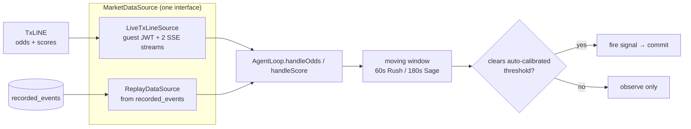

  
  
  

# 1 · Core Functionality & Data Ingestion

> *Does the robot run stably, consuming TxLINE's data (real or simulated) without choking?*

## The short answer

Yes, and we can prove it with a real match. On **July 14–15, 2026**, we watched Sentinel Arena's agents consume the live TxLINE feed for the World Cup semifinal **France × Spain** from kickoff to full-time. During roughly two hours of play, the two agents ingested the odds stream continuously and committed **over eight thousand signals** between them, without a single stall and with the backend answering health checks in **under one second** the entire time. Nothing was fed to them by hand; they simply drank from the feed and worked.

## Two streams, one heartbeat

TxLINE exposes World Cup data as two independent **Server-Sent Event (SSE)** streams, one for odds, one for scores. Sentinel Arena subscribes to both and treats them as the raw material for everything downstream: odds movements trigger predictions, and the score stream's final-whistle event triggers settlement.

Ingestion is deliberately abstracted behind a single interface, `MarketDataSource`, with two interchangeable implementations, so the decision logic never knows whether it is reading a live match or a faithful replay.

- **`LiveTxLineSource`**, the real thing: it authenticates with a guest JWT, opens both SSE streams, and forwards every tick to the agent loop.
- **`ReplayDataSource`**, the same interface, but fed from odds and scores previously recorded to the database. This keeps the product demonstrable *after* a match ends, at zero cost and with byte-for-byte the same behaviour, which is what lets the judging happen in **Replay** mode with exactly the code path that ran live.

<b>Figure 1 - Live/Replay is a first-class toggle, next to the fixture selector and the connection status</b>

  

Source: The authors (2026)

## Staying on its feet when the feed wobbles

A live sports feed is not a calm thing. Connections drop, markets go silent between plays, and volatile moments produce bursts of ticks. A naïve consumer chokes on all three. Sentinel Arena was hardened against each:

- **Every drop is treated as fatal for that attempt.** Rather than trusting the underlying SSE library's internal retries, the source closes the connection itself and hands all retry timing to a dedicated `ReconnectingSseClient`, which reconnects with **exponential backoff**. The odds and scores streams reconnect independently, since either can drop without the other.
- **Silence is a normal state, not a failure.** A successful connection only means the credentials were accepted; it does not guarantee the covered fixtures are producing data at that instant.
- **Bursts never overwhelm the pipeline.** Detection stays synchronous and un-queued so it can never fall behind the feed. Only the expensive part, publishing a transaction to Solana, is serialized through a queue, so a flurry of simultaneous signals cannot fire a storm of concurrent blockchain calls and get rate-limited.

## What "ingesting a tick" actually does

For every odds message that matches the tracked market (soccer 1X2, home win, draw, away win), the agent extracts the implied percentage per outcome, pushes it into a **time-bounded moving window** (60 seconds for Rush, 180 for Sage), computes the percentage change since the window's start, feeds that to an **auto-calibrated threshold**, and fires a signal only when the move is sharp enough to clear it.

The volume this produces is real: in the France × Spain match, the aggressive agent turned the live feed into **thousands of committed signals**, each one a genuine reaction to a genuine market move.

<b>Figure 2 - Rush's live event feed: every row is one ingested market move, committed on-chain</b>

  

Source: The authors (2026)

## Never blocking the core on an optional lookup

A recurring design rule keeps ingestion robust: **an optional enrichment must never block the core pipeline.** Fetching a fixture's team names is best-effort; a failed lookup still registers a bare fixture row and keeps detection running. The same discipline applies to on-chain proof cross-checks: they enrich the record when available, but a missing proof never stalls a commit.

## Feedback on the TxLINE API

Working against a live, in-development feed surfaced real integration lessons (see the full [TxLINE feedback log](./txline-feedback-log.md)). Two shaped the ingestion design:

- **Historical scores are only served for fixtures that started between roughly 6 hours and 2 weeks ago.** Calling that endpoint the instant a match finishes fails. We adapted by polling periodically for finished-and-old-enough fixtures rather than firing a one-shot request at full-time.
- **A successful SSE connection is not a guarantee of data**, which pushed us toward the "silence is normal, every drop is fatal-for-this-attempt" reconnection model.

## Why this satisfies the criterion

The robot **runs stably on the real feed**, proven on a live World Cup match; it **handles the messy realities** of a sports stream by design rather than by luck; and it exposes the exact same code path in **Replay** so the behaviour is reproducible for any judge, at any time, at no cost. The data ingestion is not a demo prop. It is the load-bearing floor of the whole product.

*Next: [2 · Autonomous Operation →](./criteria-autonomous-operation.md)*

  

