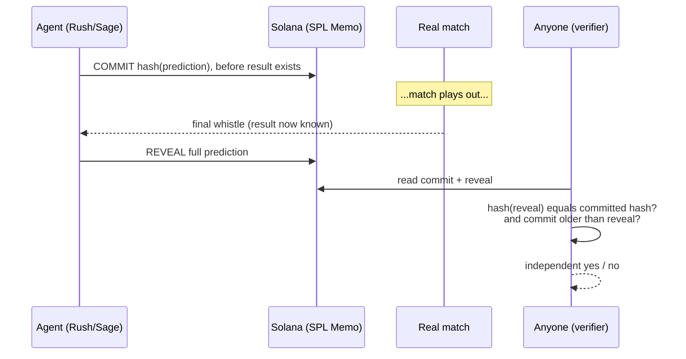

  
  
  

# 4 · Innovation & Novelty

> *Does the approach bring something new to analysis or algorithmic trading, or is it the pattern everyone does?*

## The idea everyone else skips: prove you're not lying

Almost every trading bot ever demoed makes the same claim, *"it has an X% hit rate"*, and asks you to trust it. You cannot. A backtest can be overfit. A live track record can be quietly curated: keep the winners, forget the losers, and the numbers look great. The dirty secret of algorithmic trading is that **a performance claim is only as good as your trust in the person making it.**

Sentinel Arena's core innovation is to **remove that trust from the equation entirely.** The agents do not ask you to believe their track record, they make it **cryptographically impossible to fake**, using **commit–reveal on a public blockchain**.

The proof is airtight because it rests on **two independent clocks**: TxLINE timestamps the data, Solana timestamps the decision. Since the commit provably lands before the outcome is knowable, the agent cannot have cherry-picked with hindsight. A verifiable, un-forgeable accuracy record is the thing this project contributes that the standard "a bot that trades" does not.

<b>Figure 1 - The commit → reveal flow, told to a first-time visitor in plain language</b>

  

Source: The authors (2026)

## "Don't trust us, verify it yourself"

Novelty that only the authors can check is a parlour trick. So the verification is **public and third-party-usable.** Sentinel Arena ships a standalone tool where anyone pastes any commit/reveal transaction pair and gets an independent yes/no, re-derived from the Solana blockchain itself, with no need to trust our servers.

The verifier runs four checks, each reading straight from chain: the signal IDs match between commit and reveal; the reveal references the correct commit; the revealed hash matches the committed hash; and the **commit happened before the reveal**. Crucially, it works for **any** commit/reveal pair using the Sentinel memo format, not only the ones our two agents produced.

<b>Figure 2 - The public proof verifier: independent, on-chain, works for any pair using the format</b>

  

Source: The authors (2026)

## The second novel move: a controlled two-agent experiment

Most bots run alone, so their results are anecdotes, was it a good strategy, or a good week? Sentinel Arena runs **two agents on the same feed at the same instant**, differing only in one strategy parameter. This turns a demo into a **controlled experiment**: because the inputs are identical, any difference in outcome is attributable to strategy alone, with no information-advantage confound.

It also makes the product legible: the abstract question *"is aggressive or conservative better on this match?"* becomes something you can literally watch play out between two named characters, **Rush** and **Sage**. The arcade presentation is not decoration; it makes a rigorous, on-chain experiment immediately readable to a non-expert, without hiding any of the underlying proof.

<b>Figure 3 - Each feed row is a locked-then-revealed prediction, its hashes linking straight to the block explorer</b>

  

Source: The authors (2026)

## Innovation without a new attack surface

The commitments are anchored using Solana's **SPL Memo program**, a standard, audited, pre-deployed program with the same address on mainnet and devnet. Sentinel Arena therefore introduces its novel accountability layer with **zero custom on-chain code to deploy, and zero new audit surface**. The innovation lives entirely in *how* a standard primitive is used, not in a risky bespoke contract. That is the mature way to be novel: new capability, old dependable foundations.

## Why this satisfies the criterion

The standard entry is *"an agent that trades and claims a hit rate."* Sentinel Arena's contribution is a category shift: **an agent whose honesty about its own track record is mathematically provable by anyone, on-chain, before the result exists**, delivered as a controlled two-agent experiment and built on an audited primitive rather than a bespoke contract. It answers a question the pattern everyone does cannot: *why should I believe your numbers?*

*Previous: [← 3 · Logic & Architecture](./criteria-logic-architecture.md) · Next: [5 · Production Readiness →](./criteria-production-readiness.md)*
