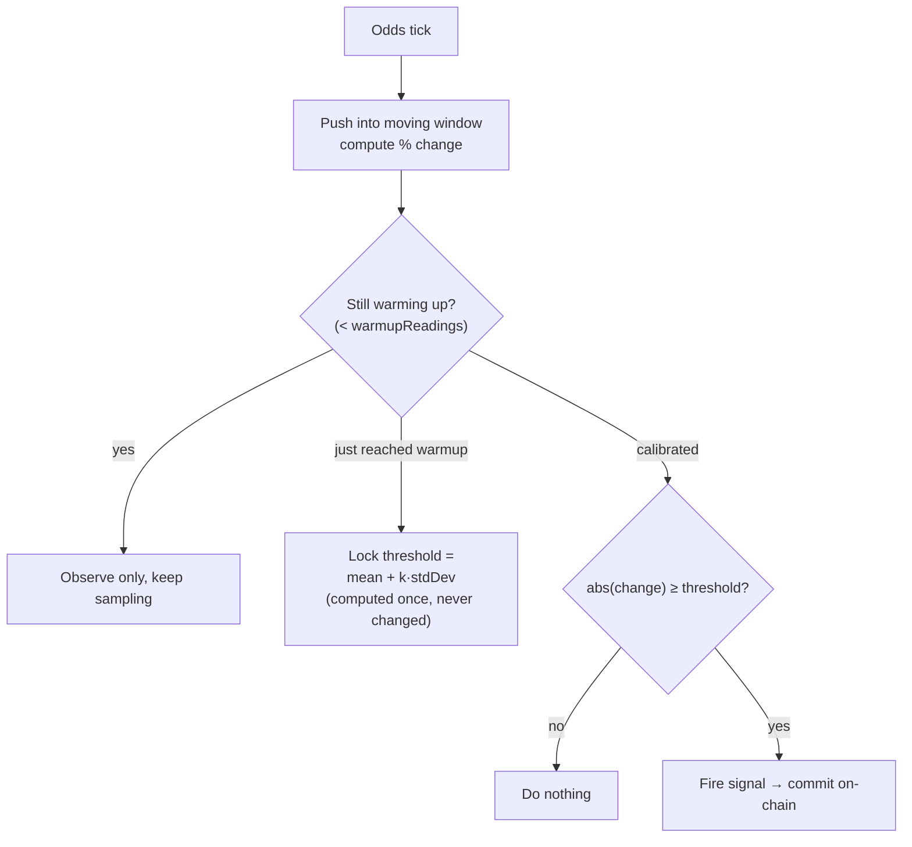
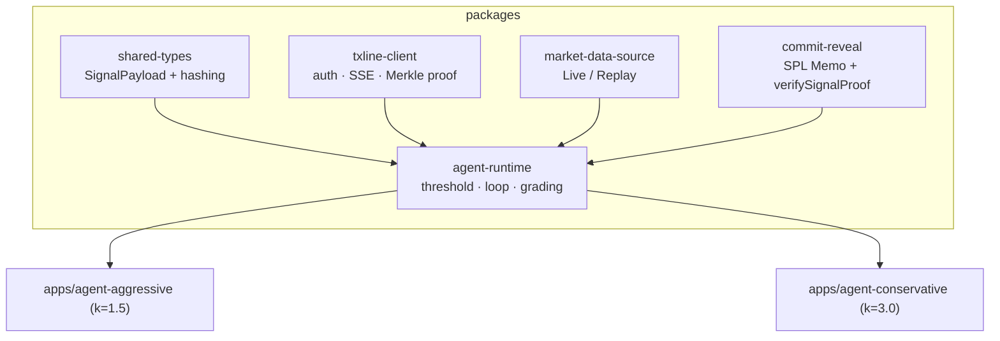

  
  
  

# 3 · Logic & Code Architecture

> *The decision rule is clear, deterministic and defensible, you can explain why the robot did each thing.*

## A decision rule with no magic numbers

The most common way a trading bot becomes indefensible is a hand-tuned constant: *"fire when the odds move more than 5%."* Where did 5% come from? Nobody can say, and it is wrong for a sleepy group-stage match and a frantic final alike.

Sentinel Arena has **no such constant**. Its trigger threshold is never a human-picked number, it is **calibrated per fixture, from the volatility the agent itself observes** during a short warmup window. The rule is a single, explainable formula:

> **threshold = mean(observed moves) + k × standard-deviation(observed moves)**

During warmup, the agent watches how much a match's odds normally jiggle. Once it has enough readings, it locks a threshold meaning *"a move that is `k` standard deviations sharper than this match's own normal chatter."* The threshold is computed once and **never silently recalculated**, so a signal's meaning is stable and auditable. The only human choice is `k`, the sensitivity multiplier, and that is a **strategy** decision, not an alarm-tuning knob.

## Two agents, one parameter, opposite temperaments

That single parameter creates the two competitors. They share **100% of the detection, commit, and grading code**; only their configuration differs.

<b>Table 1 - The two strategies differ by configuration only</b>

| | **Rush** (aggressive) | **Sage** (conservative) |
|---|---|---|
| Sensitivity multiplier `k` | **1.5×** | **3.0×** |
| Detection window | **60 s** | **180 s** |
| Temperament | Reacts fast to any wobble | Only moves on dramatic swings |

Source: The authors (2026)

Because both agents read the **same feed at the same instant**, the experiment is clean. And the hypothesis holds up in the real data: across France × Spain, Rush fired roughly **2.5× as many signals** as Sage, exactly what `k = 1.5` versus `k = 3.0` should produce, observed live.

<b>Figure 1 - The two strategies explained in the product's own words, mascots and all</b>

  

Source: The authors (2026)

## Every decision leaves an auditable trail

"Defensible" means the reasoning is recorded. Each signal freezes a canonical **`SignalPayload`** capturing exactly what the agent saw and decided: the fixture, the outcome, the triggering odds message and its timestamp, the before/after percentages, the computed change, and the moment of detection. That payload is hashed, and the hash is committed on-chain. After the match, the full payload is revealed, and anyone can recompute the hash to confirm the record was never altered.

<b>Figure 2 - Cumulative accuracy plotted over real match time; each step is a graded, on-chain decision</b>

  

Source: The authors (2026)

## Architecture: shared logic, thin agents, clean seams

The codebase is a TypeScript monorepo whose structure enforces the "one brain, two configs" principle.

<b>Table 2 - The load-bearing packages and what each owns</b>

| Package | Responsibility |
|---|---|
| **`shared-types`** | The canonical `SignalPayload`, deterministic hashing, and DB row types. |
| **`txline-client`** | Auth, SSE subscription, snapshots, and on-chain Merkle-proof validation. |
| **`market-data-source`** | The `MarketDataSource` interface with Live and Replay implementations. |
| **`commit-reveal`** | The Solana commit/reveal transactions and the public `verifySignalProof`. |
| **`agent-runtime`** | `AutoCalibratedThreshold`, the moving window, the `AgentLoop`, the grading engine. |
| **`apps/agent-aggressive` · `apps/agent-conservative`** | Thin config shims. Same loop, different `k`. |

Source: The authors (2026)

Two architectural rules keep the logic clean: **network values come from a single assembler** (RPC, program ID, mint, JWT host, API host must all belong to the same network), and **optional integrity checks never gate the core** (a commit never waits on a proof being available).

## Why the numbers look the way they do, and why that's honest

A judge glancing at ~40% accuracy might frown. Each agent tracks **three outcomes per match**, home win, draw, away win, and fires on whichever moves sharply. Only one of the three can end up true, so two of the three buckets are *guaranteed* wrong once the match ends. Chance alone sits near 33%, not 50%. Check any signal that bet on the actual final result and it is right almost every time. We consider it a point of integrity that the system reports this plainly rather than cherry-picking a flattering subset.

## Why this satisfies the criterion

The decision rule is a **single, transparent formula** with exactly one human input, and that input is a declared strategy choice rather than a mystery constant. The rule is **deterministic**, calibrated once and never silently changed, and **auditable** down to the triggering tick via an on-chain, recomputable record. The architecture makes the logic **shared, thin, and seam-clean**. You can explain why the robot did each thing, because the robot wrote down its reasoning and signed it.

*Previous: [← 2 · Autonomous Operation](./criteria-autonomous-operation.md) · Next: [4 · Innovation & Novelty →](./criteria-innovation.md)*
