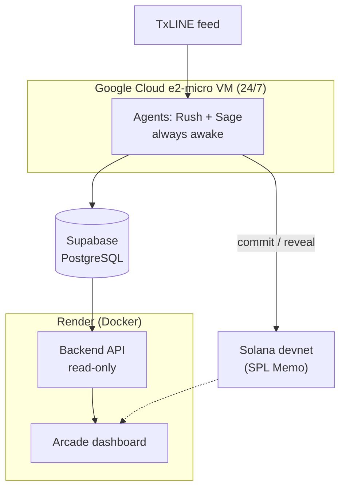

  
  
  

# 5 · Production Readiness

> *Would a real trading desk use this tomorrow? Does it have metrics, logs and product-grade reliability?*

## What a desk actually needs, and what's already here

A trading desk does not adopt a toy. It adopts something deployed, observable, reliable under load, and honest about its own limits. Sentinel Arena is built to that bar, and, unusually for a hackathon entry, it was validated against real infrastructure during a live World Cup match rather than against mocks.

<b>Figure 1 - The operator's view: live metrics, verifiable records and per-agent wallets, all in one screen</b>

  

Source: The authors (2026)

## Deployed, for real, on the right infrastructure

Nothing here is a slide. The system runs as three cleanly separated tiers, each hosted where its needs are actually met.

<b>Table 1 - The production topology</b>

| Tier | Where it runs | Why there |
|---|---|---|
| **Agents (Rush & Sage)** | Google Cloud `e2-micro`, 24/7 | Must stay awake to catch a final whistle at an unpredictable time. |
| **Backend API + dashboard** | Render (Docker) | Occasionally-viewed, read-only surface; fine to cold-start. |
| **Database** | Supabase (PostgreSQL) | Managed, durable Postgres that outlives the judging window. |
| **Chain** | Solana devnet | Real on-chain commits; SPL Memo has the same address on mainnet, so promotion is a config change. |

Source: The authors (2026)

## Metrics and logs a desk would recognise

- **Accuracy as a first-class metric,** computed over the *full* graded set, never a flattering sample, shown per agent with a live progress bar.
- **A verification status that refuses to overstate.** The badge only turns green once *every* graded signal behind the number has also had its final score cross-checked against TxLINE's own on-chain proof. Otherwise it shows an honest amber "verify pending."
- **A complete, on-chain audit trail.** Every signal's `SIGNAL → COMMIT → REVEAL` lifecycle is recorded, and every hash in the interface is a real, copyable link to the block explorer.
- **Structured operational logging** on the agents: every signal, grade, reconciliation and error is logged with the agent's identity.

<b>Figure 2 - Cumulative accuracy over real time, with a hover read-out of each agent's record at any moment</b>

  

Source: The authors (2026)

## Reliability that was earned against live infrastructure

Each reliability feature exists because a real failure mode was hit and fixed against the live feed and the public devnet RPC:

- **Rate-limit safety.** Blockchain publishing is serialized through a single spaced queue; settlement runs through the *same* queue as commits, as one unit, so it can never race ahead of not-yet-persisted commits.
- **Crash self-healing.** Orphaned signals are found and republished on restart, using the frozen hash, but only where doing so is still honest.
- **Wallet safety.** New commits pause automatically below the fee floor and resume when topped up.
- **A read-only control surface.** The dashboard cannot act on the agents' behalf, a deliberate blast-radius limit.

## Proof it survives real load

The strongest evidence is the live settle during **France × Spain** on July 14–15, 2026: the agents committed **over eight thousand signals** during the match, then autonomously published **thousands of reveal transactions** over roughly 3.5 hours after full-time, with the backend answering `200 OK` in under a second throughout. That is the closest thing to a production shift a hackathon can offer.

## Honest about its limits, which is itself production maturity

- **Settlement latency scales with signal volume.** Each reveal is its own paced on-chain transaction, so a very aggressive agent on a volatile match produces a long settle tail (Rush's ~6,400 reveals took hours to fully drain). It completes unattended; batching would be the first hardening step.
- **The read API caps a single fixture fetch at 5,000 signals**, which a full aggressive match can exceed. Raising the limit or paginating is a small, known fix.
- **This is a signal-and-accountability engine, not an order-execution engine.** It reads, decides, records and self-evaluates, the exact loop the track describes, but it does not place trades or manage P&L. That is a deliberate scope choice: the novel, defensible contribution is the *provable track record*, the hard part a desk cannot buy off the shelf.

Naming these plainly is the behaviour of a product built by people who expect it to be used.

## Why this satisfies the criterion

Sentinel Arena is **deployed on production-appropriate infrastructure**, exposes the **metrics and logs an operator needs**, and carries **reliability features earned against real failures**. It proved it can take a **real, high-volume, multi-hour shift** unattended, and it is **candid about its own edges**, which is exactly the posture a trading desk trusts. It is not a demo that happens to run; it is a product that has already worked a real day.

*Previous: [← 4 · Innovation & Novelty](./criteria-innovation.md) · Back to [Judging Criteria overview](./judging.md)*
