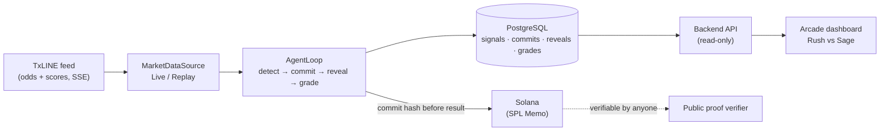

  
  
  

# Judging Criteria

**TxODDS World Cup Hackathon · Track: Trading Tools and Agents**

This section is written for one purpose: to walk a judge, criterion by criterion, through **why Sentinel Arena is a real autonomous trading agent**, not a slide, not a mock, but a system that reads the market, decides, records its decision on-chain before the result exists, and grades itself, with nobody touching it after deploy.

Everything here is backed by real, on-chain evidence. Where we show a number, it came from the live devnet deployment during real 2026 World Cup fixtures, including a match we watched settle end-to-end while writing this documentation.

<b>Figure 1 - The live Sentinel Arena dashboard (France × Spain, replayed after full-time)</b>

  

Source: The authors (2026)

## What Sentinel Arena is, in one paragraph

Sentinel Arena runs **two autonomous trading agents**, **Rush** (aggressive) and **Sage** (conservative), that watch the exact same live odds feed from **TxLINE**. Whenever an agent detects a sharp market move, it publishes a **cryptographic commitment of its prediction to the Solana blockchain before the outcome is known**, and reveals the full content only after the final whistle. The result is an accuracy track record that is **mathematically impossible to forge after the fact**: two independent timestamps, TxLINE's on the data and Solana's on the decision, prove the agent decided before the result existed. Because both agents read the same feed at the same instant, any difference in performance comes from strategy, never from an information advantage.

## The five criteria, one page each

| # | Criterion | The question it answers |
|---|-----------|-------------------------|
| 1 | [**Core Functionality & Data Ingestion**](./criteria-core-functionality.md) | Does it run stably, consuming TxLINE's feed without choking? |
| 2 | [**Autonomous Operation**](./criteria-autonomous-operation.md) | After deploy, does a human ever have to touch it? *(eliminatory)* |
| 3 | [**Logic & Code Architecture**](./criteria-logic-architecture.md) | Is every decision clear, deterministic and defensible? |
| 4 | [**Innovation & Novelty**](./criteria-innovation.md) | Does it bring something genuinely new to algorithmic trading? |
| 5 | [**Production Readiness**](./criteria-production-readiness.md) | Would a real trading desk use this tomorrow? |

## The whole system at a glance

## Try it yourself

- **Live dashboard:** [sentinel-dashboard-fq9r.onrender.com](https://sentinel-dashboard-fq9r.onrender.com/)
- **Independent proof verifier:** [/verify](https://sentinel-dashboard-fq9r.onrender.com/verify)

Built for the TxODDS World Cup Hackathon by **Pablo Azevedo** and **Cecília Galvão**.
