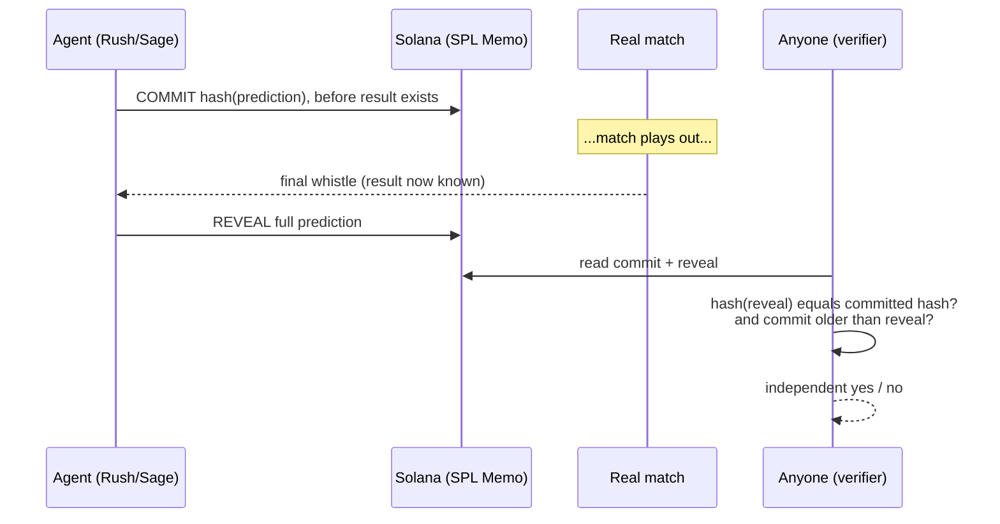

# Solana & Commit-Reveal

The whole trust model in one diagram: the hash is published **before** the result exists, and revealed only after, so anyone can prove the agent could not have cherry-picked with hindsight.



## Why the SPL Memo Program, not a custom Anchor program

Rather than writing and auditing a bespoke on-chain program, Sentinel Arena commits hashes using the **SPL Memo Program**, already deployed on both mainnet and devnet:

```
Program ID (Memo v2): MemoSq4gqABAXKb96qnH8TysNcWxMyWCqXgDLGmfcHr
```

A transaction carrying a memo instruction timestamps any string up to ~566 bytes, immutably, with a slot. That's more than enough for a commit.

```typescript
function buildMemoInstruction(memoText: string, signer: PublicKey): TransactionInstruction {
  return new TransactionInstruction({
    keys: [{ pubkey: signer, isSigner: true, isWritable: true }],
    programId: MEMO_PROGRAM_ID,
    data: Buffer.from(memoText, "utf8"),
  });
}

// SENTINEL_COMMIT|v1|{agentId}|{signalId}|{hashHex}
async function publishCommit(connection, payer, signalId, hashHex, agentId) { /* ... */ }

// SENTINEL_REVEAL|v1|{signalId}|{commitTxSig}|{recomputedHash}
async function publishReveal(connection, payer, signalId, commitTxSig, payload) { /* ... */ }
```

A dedicated Anchor program (verifying the hash match on-chain, inside the program itself, rather than via an external verifier) was scoped as an explicit **plan B**, the first thing to cut if the timeline got tight. The Memo Program alone is a complete, defensible submission on its own; the custom program was never built, by design, once the full Memo pipeline was proven end-to-end against real devnet transactions.

## Two wallets, never shared

`agent-aggressive` and `agent-conservative` sign with two separate keypairs. Commits are always signed by the agent's own wallet, so anyone auditing on Solscan can immediately tell which signal belongs to which strategy without cross-referencing anything off-chain.

## Verification, step by step

1. Look up the commit transaction by `commit_tx_sig` → read the memo → extract `hashHex`.
2. Look up the reveal transaction by `reveal_tx_sig` → read the memo → extract `recomputedHash` and the referenced `commitTxSig`.
3. Confirm `hashHex === recomputedHash`.
4. Confirm the commit's slot/timestamp is **earlier** than the reveal's (a proxy for "before the result was knowable," since the reveal only happens after `game_finalised`).

```typescript
async function verifySignalProof(connection, commitTxSig, revealTxSig) {
  const commitTx = await connection.getParsedTransaction(commitTxSig, { commitment: "confirmed" });
  const revealTx = await connection.getParsedTransaction(revealTxSig, { commitment: "confirmed" });
  const [, , , commitSignalId, committedHash] = extractMemoText(commitTx).split("|");
  const [, , revealSignalId, referencedCommitSig, recomputedHash] = extractMemoText(revealTx).split("|");

  const checks = {
    signalIdsMatch: commitSignalId === revealSignalId,
    referencesCorrectCommit: referencedCommitSig === commitTxSig,
    hashesMatch: committedHash === recomputedHash,
    commitBeforeReveal: (commitTx?.blockTime ?? 0) < (revealTx?.blockTime ?? Infinity),
  };
  return { valid: Object.values(checks).every(Boolean), checks, commitSlot: commitTx?.slot, revealSlot: revealTx?.slot };
}
```

This exact function backs `GET /api/verify?commitTxSig=&revealTxSig=` in `backend-api`, and the dashboard's `/verify` page is a thin UI over that same endpoint, a standalone tool that works for **any** commit/reveal pair using this memo format, not only the ones this project's two agents produced.

## Beyond commit-reveal: on-chain proof of the inputs too

Commit-reveal proves the agent didn't change its mind after the fact. It doesn't, by itself, prove the *inputs* were genuine. Sentinel Arena closes that second gap by cross-checking both the final score and the specific odds tick that triggered a signal against TxLINE's own on-chain Merkle roots:

- `validateStatV2`, confirms the final score used for grading matches TxLINE's daily scores Merkle root. Run **once per fixture** (all signals for that fixture share the same final result).
- `validateOdds`, confirms the exact odds tick that triggered a specific signal matches TxLINE's daily odds Merkle root. Run **once per signal**, since each has its own triggering tick.

Both were verified against real devnet data with the same rigor: a genuine proof returns `true`; the same proof with a tampered leaf (forged prices, same Merkle tree) is rejected on-chain with `InvalidSubTreeProof` / a validation failure, not a client-side check, an actual program-level rejection.

```typescript
const isValidReal = await validateSignalOddsOnchain(program, connection, programId, apiClient, realMessageId, realTs);
// → true

const tamperedProof = { ...validation, odds: { ...validation.odds, Prices: [1, 1, 1] } };
const isValidTampered = await validateOddsOnchain(program, connection, programId, tamperedProof);
// → throws AnchorError: InvalidSubTreeProof
```

The dashboard's accuracy card only shows "✅ verified on-chain" once every graded signal has cleared this check too, a separate, stricter bar than "the commit-reveal hash matched."

## Network configuration, the golden rule

RPC endpoint, program ID, token mint, JWT host, and API host must all come from the **same** network (devnet or mainnet). This project centralizes every network-dependent value in one place (`packages/txline-client/src/config.ts`) and asserts at startup that the loaded IDL's program address matches the configured network's known program ID, a mismatched pair fails loudly instead of silently misbehaving.
